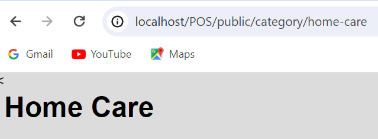

# LAPORAN SOAL PRAKTIKUM
### Nama : Mochammad Zakaro Al Fajri
### Kelas : TI-2F
### No.Absen : 19
---
## Jobsheet 2

1. Jalankan Langkah-langkah Praktikum pada jobsheet di atas. Lakukan sinkronisasi perubahan pada project PWL_2024 ke Github. 
[Klik Disini](https://github.com/Zakaal/PWL_2024/blob/main/README.md)

2. Buatlah project baru dengan nama POS. Project ini merupakan sebuah aplikasi Point of Sales yang digunakan untuk membantu penjualan

3. Buatlah beberapa route, controller, dan view sesuai dengan ketentuan sebagai berikut.

   - Home
   

   - food beverage
   

   - beauty health
   

   - home care
   

   - baby kid
   
   
   - Profil Pengguna
   

   - Penjualan
   

4. Route tersebut menjalankan fungsi pada Controller yang berbeda di setiap halaman.
   
   Jawab : 

   

5. Fungsi pada Controller akan memanggil view sesuai halaman yang akan ditampilkan.

   Jawab : 

   
